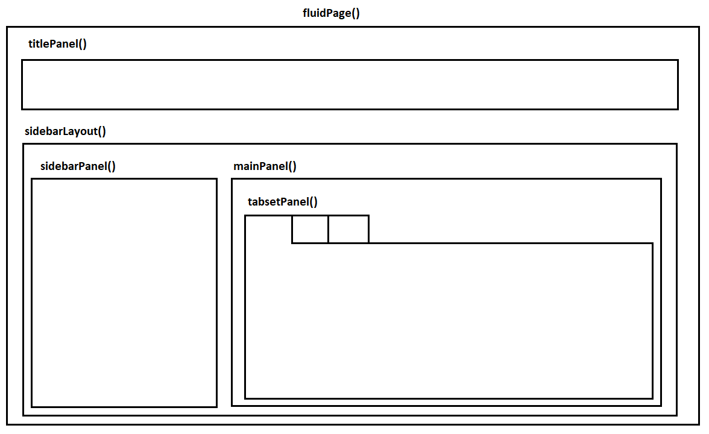

```{r}
#| message: false
#| warning: false
#| include: false

library(tidyverse)

```

## Dashboards and Research

- Research projects often produce outputs that are difficult to
communicate through a paper or even a presentation.

- With dashboards, users can filter data, inspect indicators, compare
cases, and see how results change without touching the underlying code.

- For research communication, the goal is to make part of the evidence base easier to inspect, reuse, and discuss.

## What is R `Shiny`?

A Shiny app is a web app connected to a computer running an R session.
The front facing elements are in the User Interface (UI) and the back
code is in the Server.

Users can manipulate the UI, which updates the code in the server and
gets reflected back to the ui

## Setting up an `Shiny` app template

<iframe data-external="1" width="100%" height="500" src="https://www.youtube.com/embed/iiMj6jNTchA" title="RShiny Screencast" frameborder="0" allow="accelerometer; autoplay; clipboard-write; encrypted-media; gyroscope; picture-in-picture; web-share" allowfullscreen>

</iframe>

## `Shiny` basic functions

`Shiny` creates interactive apps for users using R code. The **server**
that hosts it must have R installed (in this case your laptop) to run.
You can push your apps directly into
\href{https://www.shinyapps.io/}{shinnyapps} and share your projects!

```{r echo=TRUE, eval=FALSE}

library(shiny)

ui <- fluidPage() # generates user interface

server <- function(input, output){} # runs the R code

shinyApp(ui = ui, server = server) # runs the app

```

## The User Interface **UI**

The `fluidPage()` command creates HTML code which is used to construct
the web page. It contains the elements we want as inputs (from users)
and outputs (from the server).

```{r echo=TRUE, eval=FALSE}

ui <- fluidPage(

    # Application title
    titlePanel("My Title"),
    
    # Show a plot
    plotOutput("myPlot")

)

```

## The Server Function

The

```{r echo=TRUE, eval=FALSE}

server <- function(input, output) {

    # Store the plot into an object in output
    output$myPlot <- renderPlot({

        # draw a histogram from an object df
        hist(df$var1, main = 'Histogram')
      
    })
}

```

## Inputs (UI)

Input functions inside the `fluidPage()` command collect information
from the users that is then used to run the script in the server. This
can be done in several ways:

```{r echo=TRUE, eval=FALSE}

ui <- fluidPage(
        sliderInput( #the type of input collection we want (slider)
            inputId="input1", #the name of our input object
            label="Select a number.", #a description for the user
            value=5, #the default value
            min=1, #the min value on the slider
            max=10 #the max value on the slider
            )
        ) 

```

## Outputs (UI)

Output functions inside the `fluidPage()` display the different types of
objects we create for our web app. This is what the user will observe.
For example:

-   Plots
-   Text
-   Tables (etc...)

```{r echo=TRUE, eval=FALSE}

ui <- fluidPage(
        #the name of our output object from the server
        plotOutput(outputId="output1") 
        ) 

```

## Render Functions (Server)

`render()` functions create outputs from R scripts and transforms them
to HTML code which can be displayed in our web page. These commands go
in the server.

```{r echo=TRUE, eval=FALSE}

server <- function(input, output){

            output$output1 <- renderPlot({

              hist(df$var1)
            
            })
        }

```

## Panel Layouts (UI)



## Panel Layouts (UI)

::::: columns
::: {.column width="60%"}
```{r echo=TRUE, eval=FALSE}

# An Empty UI Structure
ui <- fluidPage(
    # Top Panel
    titlePanel("Title Panel"),
    # Bottom Panels
    sidebarLayout(
        # Left Bottom Panel
        sidebarPanel("Side Panel"
        ),
        # Right Bottom Panel
        mainPanel("Main Panel",
            # Sub Panels
            tabsetPanel(
                tabPanel("Tab Panel A"),
                tabPanel("Tab Panel B")
            )
        )
    )
)

```
:::

::: {.column width="40%"}

:::
:::::

# Penguins Example

::::::: columns
:::: {.column width="50%"}
::: {style="font-size: 0.8em;"}
<iframe data-external="1" src="https://alfredohs.shinyapps.io/pinguinos/" width="100%" height="650" style="border: 1px solid #ddd; border-radius: 8px;" allowfullscreen>

</iframe>
:::
::::

:::: {.column width="50%"}
::: {style="font-size: 0.55em;"}
```{r echo=TRUE, eval=FALSE}
# File Name: app.R
# Simple Palmer Penguins Shiny App

# Set Up ----------------------------------------------------------------------

# Install packages if needed:
# install.packages(c("shiny", "palmerpenguins", "dplyr", "ggplot2", "DT"))

library(shiny)
library(palmerpenguins)
library(dplyr)
library(ggplot2)
library(DT)

# Data ------------------------------------------------------------------------

penguins <- palmerpenguins::penguins %>% 
  mutate(
    species = as.factor(species),
    island = as.factor(island)
  )

# User interface --------------------------------------------------------------

ui <- fluidPage(
  titlePanel("Palmer Penguins Shiny Demo"),
  
  sidebarLayout(
    sidebarPanel(
      selectInput(
        inputId = "species",
        label = "Choose species",
        choices = c("All", levels(penguins$species)),
        selected = "All"
      ),
      
      selectInput(
        inputId = "island",
        label = "Choose island",
        choices = c("All", levels(penguins$island)),
        selected = "All"
      ),
      
      checkboxInput(
        inputId = "show_smooth",
        label = "Show trend line",
        value = TRUE
      )
    ),
    
    mainPanel(
      h3("Summary"),
      verbatimTextOutput("summary_text"),
      
      h3("Scatterplot"),
      plotOutput("penguin_plot", height = "450px"),
      
      h3("Data"),
      DTOutput("penguin_table")
    )
  )
)

# Server ----------------------------------------------------------------------

server <- function(input, output) {
  
  output$summary_text <- renderPrint({
    data <- penguins
    
    if (input$species != "All") {
      data <- data %>% 
        filter(species == input$species)
    }
    
    if (input$island != "All") {
      data <- data %>% 
        filter(island == input$island)
    }
    
    cat("Rows:", nrow(data), "\n")
    cat("Species:", paste(unique(data$species), collapse = ", "), "\n")
    cat("Islands:", paste(unique(data$island), collapse = ", "), "\n")
    cat("Average body mass:", round(mean(data$body_mass_g, 
                                         na.rm = TRUE), 1), "g\n")
  })
  
  output$penguin_plot <- renderPlot({
    data <- penguins
    
    if (input$species != "All") {
      data <- data %>% 
        filter(species == input$species)
    }
    
    if (input$island != "All") {
      data <- data %>% 
        filter(island == input$island)
    }
    
    data <- data %>% 
      filter(
        !is.na(flipper_length_mm),
        !is.na(body_mass_g)
      )
    
    p <- ggplot(
      data,
      aes(
        x = flipper_length_mm,
        y = body_mass_g,
        colour = species
      )
    ) +
      geom_point(size = 3, alpha = 0.8) +
      labs(
        x = "Flipper length, mm",
        y = "Body mass, g",
        colour = "Species",
        title = "Body mass and flipper length"
      ) +
      theme_minimal(base_size = 14)
    
    if (input$show_smooth) {
      p <- p + geom_smooth(method = "lm", se = FALSE)
    }
    
    p
  })
  
  output$penguin_table <- renderDT({
    data <- penguins
    
    if (input$species != "All") {
      data <- data |>
        filter(species == input$species)
    }
    
    if (input$island != "All") {
      data <- data |>
        filter(island == input$island)
    }
    
    datatable(
      data,
      options = list(pageLength = 8),
      rownames = FALSE
    )
  })
}

# Run app ---------------------------------------------------------------------

shinyApp(ui = ui, server = server)
```
:::
::::
:::::::

## Publish App


# More Examples

##  {background-iframe="https://parmsam.shinyapps.io/MixThingsUp/"}

##  {background-iframe="https://nicohahn.shinyapps.io/spotify_habits/"}

##  {background-iframe="https://dashboard.firsa.eu/"}

## Dashboards for Research

\[ideas here? as conclusioons\]

# Thank you for your attention!

#  {background-image="background.png" background-size="contain"}

```{=html}
<script src="https://cdn.jsdelivr.net/npm/bsky-embed@0.0.5/dist/bsky-embed.es.js" async></script>

<style>
  .f-outer-container {
    display: flex;
    flex-direction: column;
    align-items: center;
    margin-top: 20px;
  }

  .f-title {
    font-size: 1.5rem;
    font-weight: bold;
    margin-bottom: 20px;
    text-align: center;
  }

  .bsky-disclaimer-container {
    display: flex;
    justify-content: center;
    align-items: stretch; /* let children define their height */
    gap: 40px;
    flex-wrap: wrap;
    width: 100%;
  }

  .bsky-section {
    background-color: #ffffff;
    padding: 10px;
    border: 1px solid lightgray;
    border-radius: 12px;
    box-shadow: 0 2px 4px rgba(0, 0, 0, 0.05);
    width: 40%;
    font-size: 0.7rem;
    display: flex;
    align-items: center;
    justify-content: center;
  }

  .disclaimer-wrapper {
    width: 45%;
    display: flex;
    align-items: top;
  }

  .disclaimer-section {
    font-size: 1.2rem;
    line-height: 1.4;
    text-align: left;
  }
</style>

<div class="f-outer-container">
  <div class="f-title">About the FIRSA Project</div> <br>

  <div class="bsky-disclaimer-container">
    <div class="bsky-section" id="firsa-eu.bsky-container">
      <bsky-embed  
        username="firsa.eu"  
        limit="1"  
      ></bsky-embed>
    </div>

    <div class="disclaimer-wrapper">
      <div class="disclaimer-section">
        <strong>Disclaimer:</strong>
        <br><br>
        This project has received funding from the European Union Marie Skłodowska-Curie Postdoctoral Fellowships / ERA Fellowships action under grant agreement No. 101180601 under the title: <em>Understanding FinTech Regulatory Sandbox Development in Europe</em> (FIRSA). 
        <br><br> 
        Learn more at the <a href="https://firsa.eu/" target="_blank">project website</a>.
        <br><br>
        <div style="text-align: center;">
          
        </div>        
      </div>
    </div>
  </div>
</div>
```
